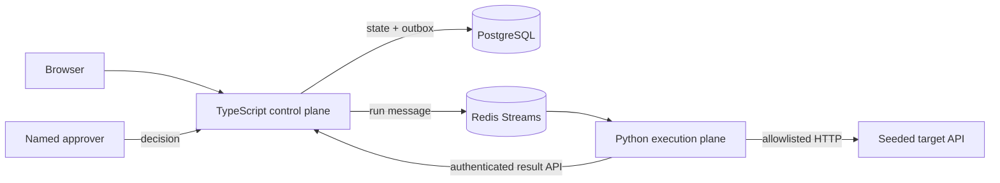

# Verity

**Evidence before action.**

Verity is an independent engineering study: a narrow governed-verification platform that turns structured specifications into declarative checks, runs them across an isolated execution boundary, records typed evidence, and requires a named human decision before remediation.

It is not a clone of, affiliated with, or endorsed by any company.

## Current status

Phase 0 of the end-to-end rebuild is complete on `feat/e2e-platform`: a pinned pnpm/Turborepo workspace, a real Next.js 16 control application, the official shadcn `sidebar-09` foundation, responsive nested navigation, and working light/dark/system themes. The original hosted preview is preserved at `v0.1-ui-preview` but retired from the reviewer path.

The local model path is keyless by design: Docker Compose runs Ollama and pulls `qwen3:4b-instruct`. Cassette replay remains a deterministic CI and recovery mode, not the primary reviewer experience. Anthropic support is optional.

## Target reviewer path

1. Start the local reviewer console with Docker Compose.
2. Select **Run verification** and watch the deterministic event stream.
3. Open **Retry applies the order twice**.
4. Inspect the request, response, assertion, and SHA-256 evidence.
5. Review the policy-constrained unified diff.
6. Approve as the seeded approver and watch staging re-verification complete.
7. Inspect the named, hash-chained audit trail.

This workflow is being implemented phase-by-phase. It will not be presented as complete until the Compose integration test reproduces it from a clean checkout.

## Local boundary

```bash
docker compose up --build
```

Then open `http://localhost:3000`. On the first run, Compose downloads the pinned Ollama image and the approximately 2.5 GB local model. PostgreSQL is visible only to the control-data network. Redis is the shared dispatch boundary. The Python runner has no database credential and reaches the target on a separate internal network. Application containers use read-only filesystems, dropped capabilities, resource limits, and pinned upstream image digests.

For the verified UI foundation without containers:

```bash
pnpm install --frozen-lockfile
pnpm check
pnpm dev
```

## Architecture



## Executable guardrails

- `pnpm check` runs lint, route-aware type checking, architecture tests, and a production build through the Turborepo task graph.
- `pytest apps/runner/tests` checks strict schema rejection, the generated-check trust ceiling, and canonical evidence hashing.
- `CHECK_DSL.md` defines the grammar before generation code.
- `DECISIONS.md` records the runtime choices and current dependency versions.
- `SEEDED_DEFECTS.md` is the answer key and intentionally absent from the walkthrough.

## Scope boundary

Verity does not claim general autonomous remediation, multi-tenancy, billing, arbitrary-code execution, or production certification. The rebuild is specifically proving one governed vertical slice: specify → generate → review → execute → inspect evidence → approve remediation → re-verify → release decision.
