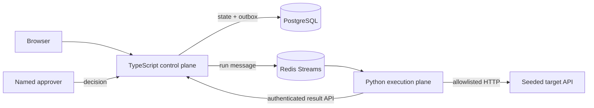

# Verity

**Evidence before action.**

Verity is an independent engineering study: a narrow governed-verification platform that turns structured specifications into declarative checks, runs them across an isolated execution boundary, records typed evidence, and requires a named human decision before remediation.

It is not a clone of, affiliated with, or endorsed by any company.

## Current status

Phases 1–2 are complete on `feat/e2e-platform`. The pinned pnpm/Turborepo workspace provides a Next.js 16 control plane with package-enforced contracts/domain/data boundaries, Prisma migrations and deterministic PostgreSQL seed, Auth.js credentials with four governed roles, the official shadcn `sidebar-09` foundation, responsive nested navigation, working light/dark/system themes, seven real configuration surfaces, and a live execution/evidence path. The original hosted preview is preserved at `v0.1-ui-preview` but retired from the reviewer path.

The local model path is keyless by design: Docker Compose runs Ollama and pulls `qwen3:1.7b`. Cassette replay remains a deterministic CI and recovery mode, not the primary reviewer experience. An optional Anthropic adapter uses the same constrained schema for a provider comparison, but it is never required for the full local flow.

Model candidates are born at conservative `probe` trust. The runner selects a typed strategy from the specification—for example, an idempotency requirement must produce request → status → side-effect replay—and then validates the model JSON again before returning it. The model cannot replace a required reliability assertion with plausible prose or a weaker check.

The complete Phase 2 path is also live: creating a run and its outbox message is one PostgreSQL transaction; the control plane relays to a Redis Stream; the database-blind Python consumer claims idempotency before work; the fixed DSL performs real status, JSON-path, latency and replay assertions against a separately persisted target; and an authenticated callback writes findings plus redacted, canonical SHA-256 evidence. The run page receives state through SSE, and the results page recomputes every hash on read.

## Target reviewer path

1. Start the local reviewer console with Docker Compose.
2. Select **Run verification** and watch the SSE-backed run resolve.
3. Open **Retry applies the order once**.
4. Expand its replay diff and inspect the before/after side-effect count and verified SHA-256 evidence.
5. Confirm the six planted defects produce findings while the health control passes.

Configuration, execution, findings and evidence are complete. Remediation, re-verification and the final release decision remain Phase 3 work and are not represented as finished.

## Phase 2 reviewer path

1. Sign in as `engineer@verity.local` and open **Operate → Runs**.
2. Select **Run approved checks**. Run and CheckRun rows plus the outbox message commit atomically before Redis delivery.
3. Watch the isolated Python consumer complete real HTTP probes. The browser receives changing snapshots over one authenticated SSE connection.
4. Confirm findings for unbound callback configuration, caller-field casing, unbounded burst work, non-idempotent retry, HTTP-200 error envelopes and a path-specific latency regression.
5. Open **Results**, expand the replay diff, and confirm every result displays **Hashes verified**.
6. Repeat delivery is harmless: the worker's Redis claim and callback upserts prevent duplicate execution records, findings and evidence.

## Phase 1 reviewer path

1. Sign in as `engineer@verity.local`.
2. Inspect the registered fixture boundary in **Applications** and its live React Flow topology in **System Graph**.
3. Create a requirement in **Specifications**, then save the same title again to produce an immutable v2.
4. Confirm the new versions appear as gaps in **Coverage**.
5. Select v2 in **Studio** and generate with Ollama. Verity runs the identical governed prompt twice and stores the candidate only if the normalized outputs match.
6. Inspect the typed definition in **Test Library**, approve it into the executable suite, and confirm v2 changes to covered.
7. Inspect the six bounded capability strategies in **AI Agents** and switch light/dark/system appearance at any point.

## Local boundary

```bash
docker compose up --build
```

Then open `http://localhost:3000`. On the first run, Compose downloads the pinned Ollama image and the approximately 1.4 GB local model. Only the Ollama daemon joins the outbound `model-egress` network so it can retrieve that model; the runner reaches it over the internal `model` network, and the control plane joins neither. PostgreSQL is visible only to the control-data network. Redis is the shared dispatch boundary. The Python runner has no database credential and reaches the target on a separate internal network. Application containers use read-only filesystems, dropped capabilities, resource limits, and pinned upstream image digests.

To compare the same request with Anthropic, export the key in your shell—never paste it into the UI or commit it—and start the explicit egress overlay:

```bash
export ANTHROPIC_API_KEY='...'
docker compose -f compose.yaml -f compose.anthropic.yaml up --build
```

The overlay grants cloud egress only to the runner. The normal Compose topology remains keyless and outbound-restricted.

The database initializer applies all migrations and the idempotent seed before the control plane starts. A second PostgreSQL container belongs only to the target-data network, so the target fixture persists orders without sharing the control database. Local demo users are `viewer@verity.local`, `engineer@verity.local`, `approver@verity.local`, and `admin@verity.local`; all use `Verity123!`.

For the verified UI foundation without containers:

```bash
pnpm install --frozen-lockfile
docker compose up -d postgres
pnpm db:deploy
pnpm db:seed
pnpm check
pnpm dev
```

## Architecture



### Why the target service is in this repository

`apps/target` is a deterministic, seeded demo fixture: it makes the portfolio walkthrough reproducible and gives the runner a safe system on which to prove real HTTP probes, evidence capture, defect discovery and later remediation. It is not the intended customer deployment model.

In a production installation, the customer registers an application endpoint and credentials in the control plane. The control plane stores an encrypted credential reference and issues a narrowly scoped job; a runner deployed inside the customer's network or CI environment resolves that reference and calls allowlisted staging/services over private networking. Only typed results and redacted evidence return to the control plane. Agents, sidecars, private links, CI integrations and signed webhooks are deployment variants of that same boundary. Verity's embedded target substitutes for the external application only so a reviewer can reproduce the complete system from one repository.

### Authentication choice

Auth.js 4 is a deliberate, time-boxed v1 exception rather than a claim that it is the best greenfield choice in 2026. It provides stable credentials/JWT sessions for the four seeded personas without adding account-management scope. Better Auth is the preferred migration target when this study grows beyond a local reviewer environment—especially for organizations, OAuth/passkeys, SSO/SCIM or real account lifecycle management. The migration trigger and trade-off are recorded in `DECISIONS.md`.

## Executable guardrails

- `pnpm check` runs Prisma generation, lint, route-aware type checking, architecture tests, and a production build through the Turborepo task graph.
- `.venv/bin/pytest -q apps/runner/tests` runs 13 checks covering strict rejection, the generated-check trust ceiling, provider contract parity, real JSON-path/replay evaluation, secret redaction and canonical evidence hashing.
- `pnpm test:integration` runs against the live Compose stack after a reviewer run and proves duplicate delivery, zero pending work, callback authentication and database evidence immutability.
- `lint-imports` enforces that the execution plane cannot import control-plane or database packages.
- The production Compose image build runs the same dependency-aware workspace graph; a one-shot non-root initializer proves migrations and seed before startup.
- `CHECK_DSL.md` defines the grammar before generation code.
- `DECISIONS.md` records the runtime choices and current dependency versions.
- `SEEDED_DEFECTS.md` is the answer key and intentionally absent from the walkthrough.

## Scope boundary

Verity does not claim general autonomous remediation, multi-tenancy, billing, arbitrary-code execution, or production certification. The rebuild is specifically proving one governed vertical slice: specify → generate → review → execute → inspect evidence → approve remediation → re-verify → release decision.
