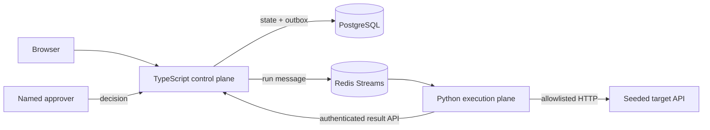

# Verity

**Evidence before action.**

Verity is an independent engineering study: a narrow governed-verification platform that turns structured specifications into declarative checks, runs them across an isolated execution boundary, records typed evidence, and requires a named human decision before remediation.

It is not a clone of, affiliated with, or endorsed by any company.

## Reviewer path

1. Open the live reviewer console.
2. Select **Run verification** and watch the deterministic event stream.
3. Open **Retry applies the order twice**.
4. Inspect the request, response, assertion, and SHA-256 evidence.
5. Review the policy-constrained unified diff.
6. Approve as the seeded approver and watch staging re-verification complete.
7. Inspect the named, hash-chained audit trail.

The public experience uses cassette replay so it has no API-key, cost, or model-availability dependency.

## Local boundary

```bash
docker compose up --build
```

Then open `http://localhost:3000`. PostgreSQL is visible only to the control-data network. Redis is the shared dispatch boundary. The Python runner has no database credential and reaches the target on a separate internal network. Containers run as non-root, with read-only filesystems, dropped capabilities, resource limits, and pinned upstream image digests.

## Architecture



## Executable guardrails

- `npm test` checks the non-executable DSL, append-only model shape, and absence of database credentials from the runner.
- `pytest apps/runner/tests` checks strict schema rejection, the generated-check trust ceiling, and canonical evidence hashing.
- `CHECK_DSL.md` defines the grammar before generation code.
- `DECISIONS.md` records the runtime choices and current dependency versions.
- `SEEDED_DEFECTS.md` is the answer key and intentionally absent from the walkthrough.

## What this does not do

This v1 does not claim general autonomous remediation, multi-tenancy, billing, arbitrary-code execution, or production certification. The live URL is a deterministic reviewer surface; the repository makes the intended runtime boundaries and security contracts inspectable and locally executable. Full persistence, live LLM generation, scheduler, CI trigger, and multi-system tenancy remain explicitly outside the public demonstration.
