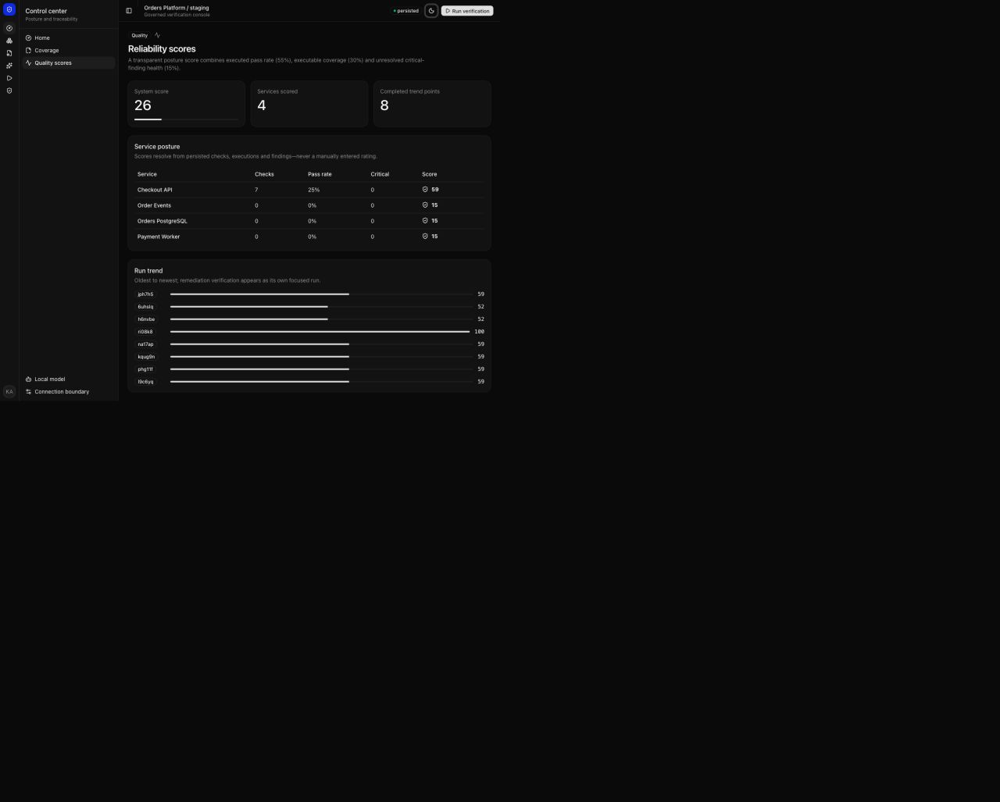
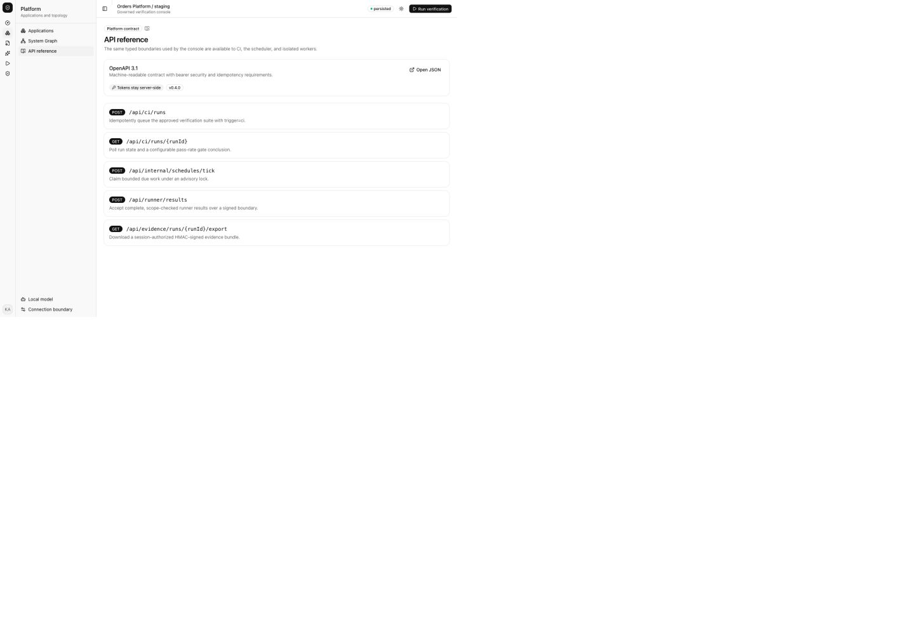
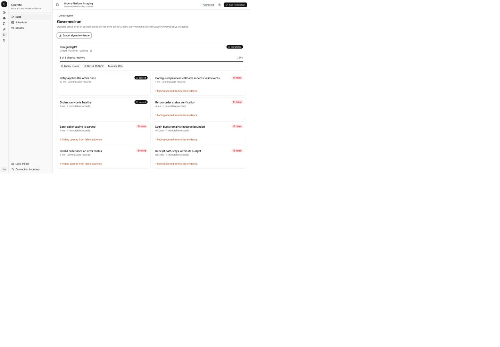
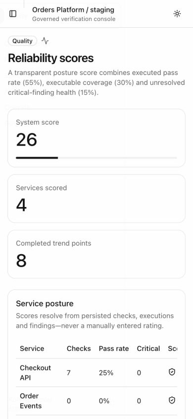

# Verity reviewer guide

This is an independent engineering study, not a clone or company-affiliated product. The fixture target makes the full system reproducible; in a production deployment the isolated runner connects to a registered customer staging endpoint over private networking.

## Five-minute recording

1. **0:00–0:35 — Architecture.** Show the README diagram and `docker compose ps`. Call out separate control, execution, target, staging, model and governance networks; the Python runner has no database credential.
2. **0:35–1:20 — Governed intent.** Sign in as `engineer@verity.local` / `Verity123!`. Open Specifications → Studio → Test Library. Generate with Ollama and show that the candidate is schema-valid, deterministic on replay and draft until reviewed.
3. **1:20–2:15 — Real execution.** Run the approved suite. Show SSE progress, persisted findings, the intentionally low pass rate caused by seeded defects, recomputed evidence hashes and the signed evidence export.
4. **2:15–3:35 — Human-gated remediation.** Propose the allowlisted idempotency fix as engineer. Sign in as `approver@verity.local` / `Verity123!`, record the decision reason, and run the exact check against isolated staging. Show its 100 score and verified promotion.
5. **3:35–4:25 — Operations.** Open Quality scores, Schedules and API reference. Explain that manual, scheduled and idempotent CI runs reuse one transactional outbox path. Show the SHA-pinned workflow and `pnpm test:operational` result.
6. **4:25–5:00 — Trust close.** Open Audit chain and show cryptographic verification from genesis to head. End on scope: this proves the cross-stack architecture and control discipline, not general autonomous remediation.

## Captured production views










## Release proof

```bash
pnpm check
.venv/bin/pytest -q apps/runner/tests
pnpm test:integration
pnpm test:phase3
pnpm test:operational
```

The seeded application is supposed to fail most checks; discovering those failures is the product behavior. The demo CI gate uses a 10% minimum only to prove automated discovery reaches a terminal decision. A healthy integration should raise the threshold to its release policy.
