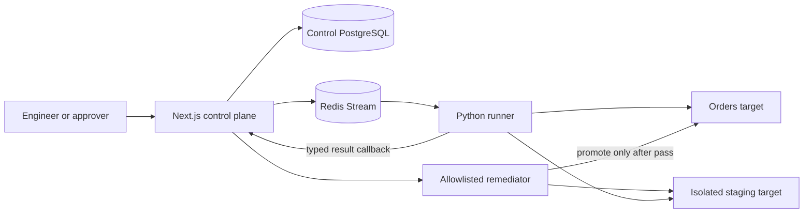

# Verity system walkthrough

This is the plain-language explanation of what Verity does, why it exists, and how one verification moves through the entire system. Read this before the detailed architecture decisions.

## The problem

Teams often know what an application should do, but the requirement, the automated check, the observed result, the proposed repair and the approval decision live in different tools. That makes a simple question surprisingly difficult to answer:

> What was expected, what actually happened, what evidence proves it, who approved the change, and did the exact change fix the problem?

Verity keeps that chain connected. It converts a structured requirement into a constrained candidate check, requires review before the check becomes executable, runs it in an isolated worker, stores tamper-evident evidence, and requires a different named person to approve a bounded repair before staging verification and promotion.

Verity is an independent engineering study. It demonstrates a production-shaped control pattern; it is not a general testing product or an autonomous coding agent.

## The shortest mental model

Verity has four important parts:

1. **Control plane:** the Next.js application where people define intent, make decisions and inspect state.
2. **Execution plane:** a Python worker that receives typed jobs and performs only allowlisted HTTP assertions.
3. **Target boundary:** the application being checked. The repository contains a deliberately defective Orders fixture so the demo is reproducible.
4. **Governance boundary:** the remediator can apply one exact, allowlisted repair to staging and promote it only after approval and a passing re-check.

The control plane owns business state. The runner has no control-database credentials. The target owns a different database. The remediator has access only to two fixed target source files and cannot accept a caller-selected path or command.

## People and permissions

Four seeded roles make the trust boundaries visible:

| Role | Can inspect | Can start work | Can propose repair | Can approve repair |
| --- | --- | --- | --- | --- |
| Viewer | Yes | No | No | No |
| Engineer | Yes | Yes | Yes | No |
| Approver | Yes | No | No | Yes |
| Admin | Yes | Yes | Yes | Yes, if not the proposer |

The important rule is separation of duties: the proposer cannot approve the same remediation. The server checks it for a useful error, and PostgreSQL enforces it again so another client cannot bypass the rule.

## The complete lifecycle

### 1. Register the application boundary

The seeded Orders Platform records its environment, base URL, services and dependencies. The System Graph renders those persisted relationships. In a real installation, this registration would point at customer endpoints and encrypted credential references rather than a target stored in this repository.

### 2. State the expected behavior

A specification is structured JSON, not loose prose. It identifies an endpoint, method, invariants and optional latency budget. Saving a changed requirement creates a new immutable version. Older versions remain available, so coverage can show when the requirement changed but its checks did not.

### 3. Generate a candidate check safely

Studio sends the structured intent to Ollama by default. Ollama runs locally, so the complete reviewer path needs no cloud API key. Anthropic is an optional comparison provider behind the same interface.

The model does not write Python, JavaScript or shell commands. It can return only a small JSON check definition. The runner understands five operations: make an HTTP request, assert a status, assert a JSON path, enforce a latency budget, and compare repeated requests.

Generation is governed in four layers:

1. Untrusted specification text is delimited as data, not mixed into system instructions.
2. The provider constrains output to JSON Schema.
3. Pydantic validates the result strictly and rejects unknown or unsafe fields.
4. The identical request runs twice; a candidate is stored only when normalized outputs match.

Generated checks begin as `draft`, have `origin=generated`, and cannot be born at `mutate` trust. Typed strategies also prevent a model from satisfying an idempotency requirement with an easier but irrelevant assertion.

### 4. Review before execution

An engineer inspects the candidate in Test Library and either validates or rejects it. Authored and generated checks use the same contract after that point. Validation is the boundary between a model proposal and an executable suite.

### 5. Create a run atomically

Starting a run creates the Run, its CheckRun rows and an OutboxMessage in one PostgreSQL transaction. This avoids the dual-write failure where database state exists but no queue message was produced, or a queue message exists for state that never committed.

After commit, the relay publishes the outbox payload to a Redis Stream. If publishing fails, the durable outbox row remains available for retry and inspection.

### 6. Claim before touching the target

The Python worker reads through a Redis consumer group. Before making any target request it claims a run-scoped idempotency key. A duplicate stream delivery therefore cannot execute the target twice after the first delivery completed.

This is **at-least-once delivery with idempotent processing**, not an impossible exactly-once claim. Redis may redeliver; Verity makes redelivery harmless through the claim plus database uniqueness constraints on results and evidence.

### 7. Execute the declarative check

The runner validates that the check's base URL is in its configured allowlist, interprets the fixed operations and calls the target with `httpx`. It cannot import control-plane packages or query the control database.

The seeded Orders target contains six real defects: an unbound callback configuration, caller-field casing mismatch, burst degradation, non-idempotent retry, HTTP 200 with an error body, and a path-specific latency regression. Failing checks are expected—the product is demonstrating that it can discover and explain them.

### 8. Return typed, tamper-evident evidence

The runner redacts credentials, creates typed request/response/assertion/trace records and posts a complete result to one bearer-authenticated callback. The control plane canonicalizes every evidence payload, stores its SHA-256 hash, and creates findings idempotently.

The Results page recomputes hashes on every read. PostgreSQL triggers reject updates and deletes of evidence. A signed export binds a complete run bundle with HMAC-SHA256. These mechanisms serve different purposes:

- the evidence hash detects a changed record;
- append-only database guards prevent ordinary mutation;
- the HMAC proves an exported bundle came from a holder of the server signing key;
- the audit chain connects decisions over time.

### 9. Stream progress to the browser

The run page opens an authenticated Server-Sent Events connection. The server emits changing snapshots while work progresses. SSE fits this one-way server-to-browser status stream with less protocol surface than WebSockets.

### 10. Propose one bounded remediation

Version 1 deliberately remediates only the seeded idempotency defect. The remediator knows one vulnerable source fragment, one fixed replacement and two constant file paths. The caller supplies a remediation ID—not a path, command or arbitrary diff to execute.

The proposed unified diff, rationale, proposer and SHA-256 are persisted. Proposal does not change production or staging.

### 11. Require an independent decision

A different approver records an approve/reject decision and reason. Rejections remain part of history. Approval stages the exact hash-bound repair and queues the original failed check against the staging target.

### 12. Verify before promotion

The normal Python execution path runs the same check against isolated staging. If every verification result passes, the remediator promotes the exact staged source to production and the finding becomes verified. If verification fails, staging is restored from production and the remediation is marked rolled back.

This is a controlled demonstration of evidence-driven change. It is intentionally not arbitrary autonomous remediation.

### 13. Preserve the decision history

Every important mutation appends an AuditEvent with actor, action, subject, payload, timestamp, previous hash and current hash. The Audit page recomputes the chain from genesis to head. Any changed or reordered event breaks verification, and PostgreSQL prevents update/delete operations.

### 14. Reuse the same path for operations

Manual, scheduled and CI-triggered runs all call the same transactional run-creation function. Schedules are claimed under a PostgreSQL advisory lock. The CI endpoint requires a bearer token and durable idempotency key, and its status endpoint evaluates a caller-supplied pass-rate threshold.

Quality Scores calculate an understandable posture from requirement coverage, latest pass rate and open critical findings. They are decision support, not a claim of statistical certainty.

## Why the target code is in this repository

The embedded target is a deterministic teaching and test fixture. It allows a reviewer to clone one repository, find real defects and safely demonstrate repair without receiving access to an employer or customer's systems.

In a production-shaped deployment:

1. a customer registers an environment and allowlisted endpoints;
2. the control plane stores references to credentials in a secret manager;
3. a runner inside the customer network or CI environment resolves those references;
4. the runner calls only registered targets over private networking;
5. redacted typed results return to the control plane through an authenticated callback.

The customer application source does not need to live beside Verity. Private runners, sidecars, CI agents, private links and signed webhooks are deployment choices around the same contract.

## What the evidence proves

The test layers answer different questions:

| Gate | Question answered |
| --- | --- |
| Typecheck/lint/build | Does the production application compile cleanly? |
| dependency-cruiser/import-linter | Are source boundaries mechanically enforced? |
| Python unit/governance tests | Does the DSL, hashing, redaction and provider contract behave correctly? |
| Model evaluations | Can injection, nondeterminism, semantic incompleteness or trust escalation cross the model boundary? |
| Playwright | Do real roles and the full browser workflow behave correctly? |
| Compose integration | Do PostgreSQL, Redis, runner, targets and callbacks preserve invariants together? |
| k6 | Does the reviewer-facing edge remain within its explicit smoke threshold? |
| Audits/Gitleaks/SBOM | Are known dependency, secret-history and supply-chain risks visible? |

No single green test proves production readiness. Together they provide reproducible evidence for the narrow claims this repository makes.

## Honest scope

Verity proves one deep vertical slice. It does not claim multi-tenancy, billing, SSO, arbitrary external discovery, a connector marketplace, general code repair, production certification or statistically mature scoring. See [SCOPE_MATRIX.md](SCOPE_MATRIX.md) for the exact delivered and excluded items.

## Recommended reading order

1. This walkthrough.
2. The root `README.md` and its architecture diagram.
3. `CHECK_DSL.md` for the model-to-runner contract.
4. `SEEDED_DEFECTS.md` for the expected discoveries.
5. `DECISIONS.md` for trade-offs and failure semantics.
6. `docs/REVIEWER_GUIDE.md` for the four-minute demonstration.
7. `docs/PHASE5_EVIDENCE.md` for the clean acceptance record.
